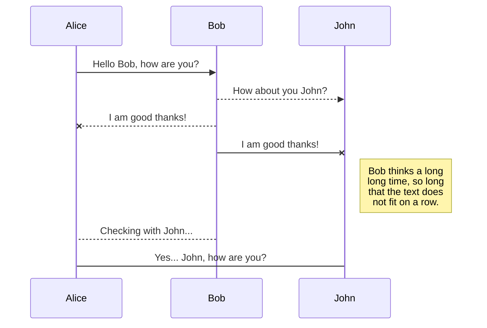
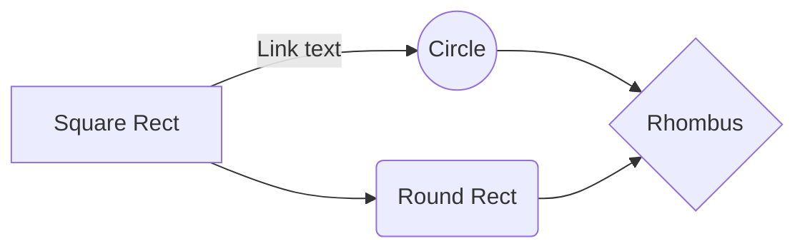

### Necessary Imports
```python
import numpy as np
import time, math
from tqdm import tqdm_notebook as tqdm

import tensorflow as tf
import tensorflow.contrib.eager as tfe
```
TensorFlow's eager execution is an imperative programming environment that evaluates operations immediately, without building graphs: operations return concrete values instead of constructing a computational graph to run later. 

Eager execution is a flexible machine learning platform for research and experimentation, providing:

An intuitive interface—Structure your code naturally and use Python data structures. Quickly iterate on small models and small data.
Easier debugging—Call ops directly to inspect running models and test changes. Use standard Python debugging tools for immediate error reporting.
Natural control flow—Use Python control flow instead of graph control flow, simplifying the specification of dynamic models.
Eager execution supports most TensorFlow operations and GPU acceleration.

```python
tf.enable_eager_execution()
```

### Hyper-parameters:
```python
BATCH_SIZE = 512 #@param {type:"integer"}
MOMENTUM = 0.9 #@param {type:"number"}
LEARNING_RATE = 0.4 #@param {type:"number"}
WEIGHT_DECAY = 5e-4 #@param {type:"number"}
EPOCHS = 24 #@param {type:"integer"}
```
By default (as of March 2019), Keras uses  [Xavier Glorot init](http://proceedings.mlr.press/v9/glorot10a/glorot10a.pdf), and PyTorch uses a weird version of  [Kaiming He init](https://arxiv.org/abs/1502.01852). Why weird? Well, look at this:

First, let’s look at Conv2D. The big difference here is the weight initialization algorithm. By default (as of March 2019), Keras uses Xavier Glorot init, and PyTorch uses a weird version of Kaiming He init. Why weird? Well, look at this:

PyTorch basically takes the inverse square root of the layer’s fan-in as a bound, and then generates a random initial weight in the range [-bound, bound]

Anyway, for Keras, we can easily write an equivalent customized init function:

```python
def init_pytorch(shape, dtype=tf.float32, partition_info=None):
  fan = np.prod(shape[:-1])
  bound = 1 / math.sqrt(fan)
  return tf.random.uniform(shape, minval=-bound, maxval=bound, dtype=dtype)
 ```
 ---
### Let's define a structure for conv block
in DavidNet that each convolution layer is always followed by a Dropout Layer then Batch Normalization layer and a Relu activation, forming a block.


 the kernels in each Convolution layer is initialised using the init_pytorch() function.
 
 ```python
 class ConvBN(tf.keras.Model):
  def __init__(self, c_out):
    super().__init__()
    self.conv = tf.keras.layers.Conv2D(filters=c_out, kernel_size=3, padding="SAME", kernel_initializer=init_pytorch, use_bias=False)
    self.bn = tf.keras.layers.BatchNormalization(momentum=0.9, epsilon=1e-5)
    self.drop = tf.keras.layers.Dropout(0.05)

  def call(self, inputs):
    return tf.nn.relu(self.bn(self.drop(self.conv(inputs))))
```
---
### A residual Block takes as input 

- **c_out**: number of input channels for a Conv Block  
- **pool**: type of pooling
- **res** : if a residual connection exists(**res= True**) or not(**res = False**)
```python
class ResBlk(tf.keras.Model):
  def __init__(self, c_out, pool, res = False):
    super().__init__()
    self.conv_bn = ConvBN(c_out)
    self.pool = pool
    self.res = res
    if self.res:
      self.res1 = ConvBN(c_out)
      self.res2 = ConvBN(c_out)

  def call(self, inputs):
    h = self.pool(self.conv_bn(inputs))
    if self.res:
      h = h + self.res2(self.res1(h))
    return h
```

### Build DAVID-Net
![David Net Architecture][davidnet]
DavidNet has only 8 convolution layers and 1 fully-connected layer

which contains 
1. a Conv-BN-Relu block,
2. three ResBlocks, two with residual components and one without
3. a global max pool 
4. a fully connected layer that outputs logits, and 
5. a mysterious “Multiply by 0.125” operation

*Outputs*: 
two values: cross-entropy loss and accuracy, in terms of the number of correct predictions in a batch.

Whats 
- self.weight?
- sparse_softmax_cross_entropy_with_logits : Computes sparse softmax cross entropy between `logits` and `labels`. Measures the probability error in discrete classification tasks
- tf.reduce_sum(ce)
- correct

```python
class DavidNet(tf.keras.Model):
  def __init__(self, c=64, weight=0.125):
    super().__init__()
    pool = tf.keras.layers.MaxPooling2D()
    self.init_conv_bn = ConvBN(c)
    self.blk1 = ResBlk(c*2, pool, res = True)
    self.blk2 = ResBlk(c*4, pool)
    self.blk3 = ResBlk(c*8, pool, res = True)
    self.pool = tf.keras.layers.GlobalMaxPool2D()
    self.linear = tf.keras.layers.Dense(10, kernel_initializer=init_pytorch, use_bias=False)
    self.weight = weight

  def call(self, x, y):
    h = self.pool(self.blk3(self.blk2(self.blk1(self.init_conv_bn(x)))))
    h = self.linear(h) * self.weight
    ce = tf.nn.sparse_softmax_cross_entropy_with_logits(logits=h, labels=y)
    loss = tf.reduce_sum(ce)
    correct = tf.reduce_sum(tf.cast(tf.math.equal(tf.argmax(h, axis = 1), y), tf.float32))
    return loss, correct
```

#### Finally, To build the model:
```python
model = DavidNet()
```

#### Download Data and preprocess:
Data Pipeline is as Follows:
1. Download CIFAR-10 Dataset.
2. * Normalize and pad for training data-set
	* Normalize for testing data-set
3. One-Hot encode Training and Test set labels
```python
# Download the The CIFAR-10 dataset
(x_train, y_train), (x_test, y_test) = tf.keras.datasets.cifar10.load_data()
# len_train: Number of training examples, len_test: Number of test examples in the dataset
len_train, len_test = len(x_train), len(x_test)

# Compute Mean and STD on Training Set
train_mean = np.mean(x_train, axis=(0,1,2))
train_std = np.std(x_train, axis=(0,1,2))

# normalize each training example by subtracting the mean and dividing by std
normalize = lambda x: ((x - train_mean) / train_std).astype('float32')

# x_train.shape = (50000, 32, 32, 3)
# Define a function that pads 4 pixels along axis 1 and 2 with values that are a reflection of the vector mirrored on the first and last values of the vector along each axis.
# Results in x_train.shape = (50000, 40, 40, 3)
pad4 = lambda x: np.pad(x, [(0, 0), (4, 4), (4, 4), (0, 0)], mode='reflect')

# Preprocess x_train by adding padding -> Normalize
x_train = normalize(pad4(x_train))
# Preprocess x_test by Normalize
x_test = normalize(x_test)

# Reshape into 1-D Arrays
y_train = y_train.astype('int64').reshape(len_train)
y_test = y_test.astype('int64').reshape(len_test)
```

#### Data AUG
x_train.shape = (50000, 40, 40, 3)

Data augmentation strategy is as follows:
- Take 32x32 Random crops using *tf.random_crop*
- Flip the image along the horizontal axis using *tf.image.random_flip_left_right*
```python
data_aug = lambda x, y: (tf.image.random_flip_left_right(tf.random_crop(x, [32, 32, 3])), y)
```

#### Define LR and optim schedule
```python
lr_schedule = lambda t: np.interp([t], [0, (EPOCHS+1)//5, EPOCHS], [0, LEARNING_RATE, 0])[0]
"""
[0, (EPOCHS+1)//5, EPOCHS]
xp : 1-D sequence of floats
The x-coordinates of the data points, must be increasing if argument period is not specified.
Otherwise, xp is internally sorted after normalizing the periodic boundaries with
"""
"""
[0, LEARNING_RATE, 0]
fp : 1-D sequence of float or complex
The y-coordinates of the data points, same length as xp.
"""
```

```python
# Compute how many batches make an Epoch
batches_per_epoch = len_train//BATCH_SIZE + 1
lr_schedule = lambda t: np.interp([t], [0, (EPOCHS+1)//5, EPOCHS], [0, LEARNING_RATE, 0])[0]
global_step = tf.train.get_or_create_global_step()
lr_func = lambda: lr_schedule(global_step/batches_per_epoch)/BATCH_SIZE
opt = tf.train.MomentumOptimizer(lr_func, momentum=MOMENTUM, use_nesterov=True)
```
#### Training Loop

```python
t = time.time()  
test_set = tf.data.Dataset.from_tensor_slices((x_test, y_test)).batch(BATCH_SIZE)  
  
for epoch in range(EPOCHS):  
  train_loss = test_loss = train_acc = test_acc = 0.0  
  train_set = tf.data.Dataset.from_tensor_slices((x_train, y_train)).map(data_aug).shuffle(len_train).batch(BATCH_SIZE).prefetch(1)  
  
  tf.keras.backend.set_learning_phase(1)  
  for (x, y) in tqdm(train_set):  
    with tf.GradientTape() as tape:  
      loss, correct = model(x, y)  
  
    var = model.trainable_variables  
    grads = tape.gradient(loss, var)  
    for g, v in zip(grads, var):  
      g += v * WEIGHT_DECAY * BATCH_SIZE  
    opt.apply_gradients(zip(grads, var), global_step=global_step)  
  
    train_loss += loss.numpy()  
    train_acc += correct.numpy()  
  
  tf.keras.backend.set_learning_phase(0)  
  for (x, y) in test_set:  
    loss, correct = model(x, y)  
    test_loss += loss.numpy()  
    test_acc += correct.numpy()  
  
  print('epoch:', epoch+1, 'train loss:', train_loss / len_train, 'train acc:', train_acc / len_train, 'val loss:', test_loss / len_test, 'val acc:', test_acc / len_test, 'time:', time.time() - t)
```

[davidnet]:https://miro.medium.com/max/2698/1*uKqdR2jn83pOhTEMLHQpJQ.png "David Net Architecture"

## UML diagrams

You can render UML diagrams using [Mermaid](https://mermaidjs.github.io/). For example, this will produce a sequence diagram:



And this will produce a flow chart:




